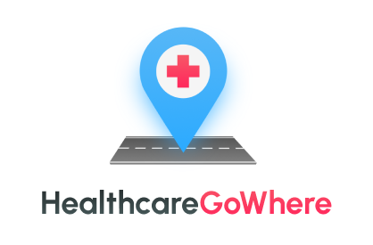
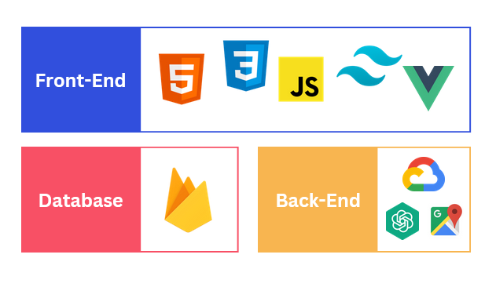

# HealthCareGoWhere

This repository contains the working files for the HealthCareGoWhere web application.

## Background

This was the submission for the Tech4Tomorrow NTU x Google Hackathon held from 4th March to 8th March 2024. Our group consisted of the following
members:

- Kean Yee Choo, 2nd Year Computer Science Undergrad
- Brian Lie, 2nd Year Computer Science Undergrad
- Zildjian Garcia (hey that's me!), 2nd Year Computer Science Undergrad
- U Pravinkumar, 2nd Year Information Engineering Media Undergrad
- Aswin Muthu, 2nd Year Information Engineering Media Undergrad

Participants were tasked with creating a project that tackled sustainability challenges across either of the 3 categories: environmental, societal and economical.

We didn't win but we learned a lot along the way.

## Our Project

Following in the same naming scheme of some online solutions in Singapore, we are proud to introduce <b>HealthcareGoWhere</b>.

HealthCareGoWhere, is a web application that aims to streamline the healthcare facility searching process, providng users a one-stop solution when looking for healthcare.

### Features

- An AI-Powered Chatbot to provide users on the most appropriate healthcare nearby based on...
  - Address
  - Type of treatment needed
  - Type of schemes available
  - Type of insurance accepted
- Integration of the Google Maps API
    - Markers placed at various coordinates based on the Chatbot's feedback
- Chat history (planned)

### Expected Impact

We hoped that this solution would improve access to healthcare facility information and enhance the experience of patients.

Users would be able to easily find accurate and up-to-date information on healthcare services available to them while fostering a positive and helpful interaction with the chatbot.

### Tech Stack


This project was mainly created using the Vue3 CLI.

<!-- LEFT OFF HERE: Continue writing the "Our Project" portion, open up our canva slides to be able to write what it's all about -->

## Project setup


### Clone the project to your specified directory and run:

```
npm install
```

### To compile and run the Chatbot API
```
node server.mjs
```

### To compile and run the project
```
npm run serve
```